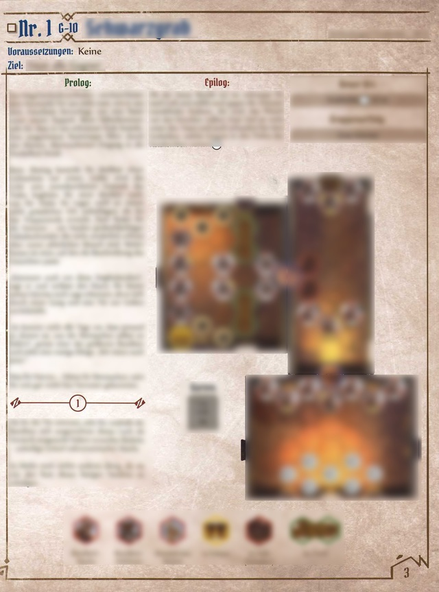

# GloomhavenScenarioViewer

Ich habe mich hier an einem leicht zu nutzenden Web Viewer for Gloomhaven Szenarien versucht.

Hauptsächlich habe ich damit angefangen, weil es die Android app nicht für die Deutsch Version gab.

## Idee

Der Web Viewer nutzt gescannte Bilder aus dem deutschen Szenarien-Buch für Gloomhaven, fügt ein paar mit CSS gebaute Rechtecke drüber, und ein bisschen einfaches Javascript kann diese abschalten.

** Bitte beachten: Dieses Repository enthält KEIN Original-Material von Gloomhaven, und Pull-Requests sollten das auch nicht tun. **

Gloomhaven unterliegt dem Copyright von Isaac Childres und Cephalofair Games, die deutsche Übersetzung gehört zu Feuerland.
Bitte respektiert diese Copyrights, und kauft dieses großartige Spiel. Es mag zunächst teuer erscheinen, aber für über 200 Stunden Spaß ist das schon nicht mehr so viel.


## Beispiel

Ein klickbares Beispiel ist hier: http://dieck.github.io/GloomhavenScenarioViewer


## Technische Details

Es gibt im Prinzip nur eine wichtige Datei:
- `index.php`, zeigt das Bild an 
- `scene.php`, wählt das Szenario aus
- `classes.inc.php`, enthält das Wie
- und `locations.txt` - hier passiert die Magie

Und dann braucht man natürlich noch Bilder. Diese kommen in das Verzeichnis `scenes`
- Der Name spielt keine große Rolle. Es müssen .jpg sein.
- Benutzt aber bitte keine Zeichen, die im Web Probleme bereiten, also Schrägstriche, Umlaute oder sowas
- z.B. `001_Schwarzgrab.jpg` or `GloomhavenScenario-001.jpg`


## Scannen

Hier kommt die Arbeit. Bitte scannt euer Szenarien-Buch ein, oder macht Photos, oder zeichnet es in Paint nach oder so :)

Das deutsche Szenarien-Buch hat übrigens "Letter"-Format, für die Scanneinstellung. Ich vermute mal, das englische auch.

Also, die ganze Seite scannen, und ggf. die Ränder etwas anpassen, so dass sie so aussehen wie auf dem Beispiel:
.

Dann das ganze auf 1366 Pixel BREITE resizen, dabei das Seitenverhältnis beibehalten.

Die `locations.txt` in diesem Projekt sollte dann für die Deutsch Ausgabe passen (sobald ich fertig bin alles zu markieren...)
Wenn jemand das für Englisch machen will, lasst es mich wissen, ich überlege dann wie man multi-language Unterstützung bauen kann :)

### Faule Leute

Nochmal zum Mitschreiben:
Gloomhaven unterliegt dem Copyright von Isaac Childres und Cephalofair Games, die deutsche Übersetzung gehört zu Feuerland.
Bitte respektiert diese Copyrights, und kauft dieses großartige Spiel. Es mag zunächst teuer erscheinen, aber für über 200 Stunden Spaß ist das schon nicht mehr so viel.

Aber... Wenn ihr ganz zufällig irgendwo über eine Datei namens `Gloomhaven.Scenario.Buch.Deutsche.Version.Best.Quality.pdf` stolpert, nachdem ihr das Spiel gekauft habt, könntet ihr eventuell diese Befehle ausprobieren wollen:
```
pdfimages -j Gloomhaven.Scenario.Buch.Deutsche.Version.Best.Quality.pdf GloomhavenScenario
mogrify -resize 1366 -quality 85 *.jpg
```

## Locations

Die `locations.txt` hat folgendes Format

```
# Kommentare beginnen mit einer # Raute

% 000 Szenarios beginnen mit %, gefolgt von einer dreistelligen Nummer, und dann dem Namen - hier könnt ihr Umlaute nutzen :)
F Dateinamen beginnen mit einem "F", gefolgt vom Dateinamen ohne .jpg

# Anzuzeigende Boxen:
# Links Oben Breite Höhe Farbe Text

# Oder gedrehte Boxen: Gib drei Koordinaten an, im Uhrzeigersinn
# AX,AY BX,BY, CX,CY Farbe Text

# Mehr als eine Seite pro Szenario? Einfach noch ein F, kein neues % davor
F Zweitedatei
# Links Oben Breite Höhe Farbe Text


```

Farben können als HTML Farb-Namen oder in Hex (#1234ef) angegeben werden.

Spezialitäten zum Text:

- Wenn derselbe Text in mehreren Zeilen steht, werden diese Markierungen zusammen an- und abgeschaltet
- Text in \[eckigen Klammern\] wird nicht angezeigt, aber für o.g. zusammen genutzte Markierung verwendet
- Text in \{geschweiften Klammern\} wird nicht angezeigt, und wird für eine andere Markierung verwendet, z.B. eine Zahl auf einer Tür schaltet den Abschnitt im Text frei. Dies kann mit normalen Elementen kombiniert werden, und muss am Ende des Textes stehen.
- Beginnt mit einem Ausrufezeichen: Markierung ist nicht ausblendbar (Nützlich als Maske für zwei Szenarien auf einer Seite)

### Example

```
% 002
F Gloomhaven-002.jpg
12 810 449 313 blue (1)
465 211 446 406 blue (1)
913 217 444 172 blue (1)
947 398 408 373 red Gegner
951 772 393 293 orange Ausstattung
520 633 349 387 lightgray Start-Raum
459 1009 480 144 gray Raum 2
430 1153 533 256 gray [Raum 2]
455 1409 477 142 gray [Raum 2]
```


## Später mal
Polygone! Kreise! Umrisse!
Falls ich jemand die Zeit dafür finde... Kennt sich jemand gut mit CSS aus?
