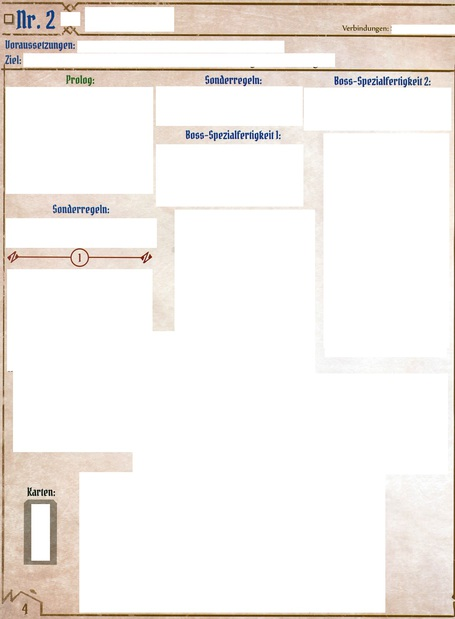

[German version of this Readme available](README.de.md)

# GloomhavenScenarioViewer

This is a easy to use scenario viewer web app for Gloomhaven.

It was created because the Android app didn't support the German edition, hence the locations in German.

## Idea

This web viewer shows scanned images of the Scenario Book of Gloomhaven, and puts in CSS overlays, which can be hidden by clicking them, using basic Javascript.

** _Please note:_ This repository does NOT contain gloomhaven images, and pull requests should not include those. **

Gloomhaven is copyrighted by Isaac Childres and Cephalofair Games, the German translation partially by Feuerland.
Please respect their copyrights, and buy this great game. It may seem expensive at first glance, but for 200+ hours of fun,
it's very resonably priced. 


## Example

Look at http://dieck.github.io/GloomhavenScenarioViewer


## Technical details


There are 2 main files:
- `index.php`, main file to show the images 
- `scene.php`, to select the scene in use
- locations.txt (see below)

Content needs to be placed in directory `scenes` 
- naming schema does not matter - needs to be .jpg files
- Do not use Non-Web-Safe characters, e.g. slashes, or Umlauts
- e.g. `001_Schwarzgrab.jpg` or `GloomhavenScenario-001.jpg`
 

## Scanning

Please scan your own scenario book, or take photos, or rearrange in Paint, to your liking :)
At least the German book is Letter format, I very much assume the English one is, too.

Crop around the outer border, see .

Resize width to 1366 pixel, keeping the ratio.

The `locations.txt` in this project should fit for the German edition.
If someone sees fit to create an english one, let me know and I'll see if I'll add multi-language support :)

### Lazy people

Let me stress again: 
Gloomhaven is copyrighted by Isaac Childres and Cephalofair Games, the German translation partially by Feuerland.
Please respect their copyrights, and buy this great game. It may seem expensive at first glance, but for 200+ hours of fun, it's very resonably priced. 

But... If you happen to stumble upon a file called `Gloomhaven.Scenario.Buch.Deutsche.Version.Best.Quality.pdf`, after you bought this, you might want to try these commands:
```
pdfimages -j Gloomhaven.Scenario.Buch.Deutsche.Version.Best.Quality.pdf GloomhavenScenario
mogrify -resize 1366 -quality 85 *.jpg
```

## Locations

The `locations.txt` file has the following formats:

```
# Comments begin with a # hash sign
% 000 Scenarios are starting with %, followed by a 3 digit number, and the scenario name
F filenames begin with "F" followed by the name without .jpg

# Boxes to show:
# Left Top Width Height Color Text

# or rotated boxes: use three coordinates, rotated clockwise
# AX,AY BX,BY CX,CY Color Text

# Multi-Page scenarios use additional F, no additional %
F secondfile
# Left Top Width Height Color Text
```

Color can be stated as html color name, or in hex #1234ef.

Specialties for Text:

- Same text in multiple lines (per filename): Toggle on/off together
- Text in \[square brackets\] is not printed out, but used for multi-line toggling, also against non-bracketed text
- Starting with an exclamation mark: Marking can not be disabled. (Useful to mask multiple scenarios on one page)

### Example

```
% 002
F Gloomhaven-002.jpg
12 810 449 313 blue (1)
465 211 446 406 blue (1)
913 217 444 172 blue (1)
947 398 408 373 red Gegner
951 772 393 293 orange Ausstattung
520 633 349 387 lightgray Start-Raum
459 1009 480 144 gray Raum 2
430 1153 533 256 gray [Raum 2]
455 1409 477 142 gray [Raum 2]
```


## Outlook
Polygons! Circles! Shapes!
If I ever find the time...

